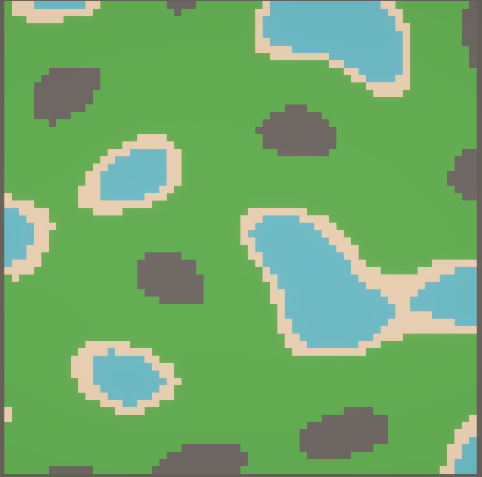

# How to use Install

Launch the project in Unity 6  
In the hierarchy click on the ProceduralGridGenerator  
Change the Generation Method in the inspector
   

# What it does
 
 
| Algorithm  | Description |
| - | - |
| Simple Room Placement | Generate rooms randomly in a set grid then link them <picture></picture> |
| Binary Space Partition | Generate rooms recursively subdivides the grid to place the rooms then link them <picture> </picture>|
| Cellular Automata | Generate random terrain then evolve <picture> </picture>|
| Noise | Generate random terrain <picture> </picture>|

# How to Use
Set the value then Play
You can also change the value while running then press Generate Grid
## ALL
| Value | Description |
| - | - |
| Grid X Value | Width of the map |
| Grid Y Value | Heigth of the map |
| Seed | Seed of the random numbers |

## Simple Room Placement
| Value | Description |
| - | - |
| Max Steps | Number of time the program tries to places rooms |
| Max Rooms | Max Number of room in the map |
| Width | Min / Max width of the room |
| Heigth | Min / Max heigth of the room |
| Step delay | Time in millisecond between each room placement |

## Binary Space Partition
| Value | Description |
| - | - |
| Horizontal Split Chance | Splitting the map horizontaly |
| Max Split Attempt | Number of time the program tries to split the map before stoping |
| Leaf Min Size | Minimum size of the area containing the room |
| Room min Size | Minimun size of the room |
| Room max Size | Maximun size of the room |

## Cellular Automata
| Value | Description |
| - | - |
| Max Steps | Number of time |
| Noise | Percentage of starting ground |
| Chunk Size | Not implemented |
| Number Of Cell To Change | Number of cell of a certain type a cell need to become that type |

## Noise
| Value | Description |
| - | - |
| NoiseType | |
| Frequency | |
| Fractal Type | |
| Octaves | |
| Nunarity | |
| Gain | |
| Weighted Strength | |
| Pingpong Strength | |
| Domain Warp Type | |
| Domain Warp | |
| Water/Sand/Grass/Rock | |

# How it Works

| Algorithm  | Description |
| - | - |
| Simple Room Placement | The algoritm try to place a room, if it can't it try again with an other room until the max room number is reached or the max steps number is reached|
| Binary Space Partition | The algoritm recursively subdivide, this process of subdividing gives rise to a representation of objects within the space in the form of a tree. Then it place rooms in the leafs of the tree|
| Cellular Automata | A cellular automaton consists of a regular grid of cells. For each cell, it call its neighbors, then according to some fixed rule it determines the new state of each cell|
| Noise | It use <a href="https://github.com/Auburn/FastNoiseLite">FastNoiseLite</a> |
